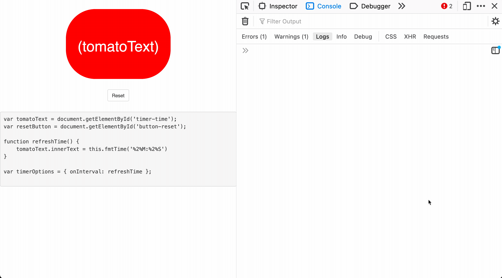

<div id="top" align="center"> 
 
 </div>


<h5 align="center">A <code>setTimeout</code> for humans (and so much more)</h5>

---



## 🧐 About

goodtimer provides a better way implement `setTimeout` and `setInterval` by providing a high-level API to easily manipulate 
countdowns. It does a number of ⭐️good⭐️ things:

* It self-corrects delays from the event loop, so it's guaranteed to stay in sync with time.
* It comes with a flexible [`timeExpression`](#timeexpressions) syntax, so you can easily express time in a number of desireable ways.
* Provides [drop-in replacement](docs/timeutil.md) to `setInterval`. 
* Can be used in projects like react with npm, or directly in the browser via [cdn](https://cdn.nickpal.to/goodtimer);

## Installation & simple usage

Download using [npm](https://npmjs.org/package/goodtimer)

```shell
npm i --save goodtimer
```

And use in your code!

```javascript
const { Timer } = require('goodtimer');

new Timer('1:00');
```

Or replace your drifty `setInterval`s with `setGoodInterval` ⭐️:

```javascript
const { setGoodInterval } = require('goodtimer').timeutil;

setGoodInterval(() => console.log("exactly 1 second!"), 1000);
```

#### 💝 _Browser-compatible client-side version now available!_

```html
<script src="https://cdn.nickpal.to/goodtimer/goodtimer-3.2.0.js"></script>
<script>
  new goodtimer.Timer('1:00');
</script>
```

➡️ Read the full API Docs [here](https://nickpalenchar.github.io/goodtimer/api/classes/timer.timer-1.html) or read below to get started quickly :bow:

---

## ⏲ Simple Usage

```javascript
const yourFn = () => {};
new Timer('1:00', yourFn); // replacement for setTimeout
new Timer('1:00', yourFn, { repeat: true }); // replacement for setInterval


const timer = new Timer('5:00'); // (Five minutes)
timer.pause();         // freezes timer at given time
timer.unpause();       // resumes timer
timer.reset();         // resests to initial value (in this case 5 minutes)
timer.toString()       // returns in UTC-like format ("5:00.000")
// ~ 1 second later ~
timer.fmtTime("%M minutes %s seconds") // -> "4 minutes 59 seconds" (many ways to use!) 
timer.gt('1:00');      // "greater than" -> true
timer.lt('60:00:00');  // "less than (60 hrs)" -> true
timer.equals('6m');    // (6 minutes, alternate notation) -> false

// or use the Time class and skip the controls
const [minute, second] = [new Time('1m'), new Time('1s')];

minute.gt(second)        // -> true
second.equals(':01')     // -> true
minute.equals(second)    // -> false
second.set(minute)       // set to new value
minute.equals(second)    // -> true
minute.toString()        // -> "1:00.000"

// `timeExpressions` are passed to Time or Timer, and can be an
// object, number, array, or string (in multiple formats)
// below are all the ways to write "25 minutes and 500 milliseconds"

new Time('25:00.5'); // string in UTC-like syntax
new Time('25m500ms'); // string with unit annotation
new Time(1500500);  // number for milliseconds
new Time({          // object with full names
    minutes: 25, 
    milliseconds: 500 
});
```

See the [full API](https://nickpalenchar.github.io/goodtimer/api) spec for many more uses, or read on for simpler ways to get started.

## 👨‍💻 Getting started with `Timer`

`Timer` is an extension of `Time`, it inherits all methods and properties, and additionally has a "count down" loop
and comes with many useful methods you'd expect from a timer. It's the main feature of goodtimer.

`Timer`'s first argument is required, which is a `timeExpression`, all other arguments are optional. If the last
argument is an object, it is assumed to be the `timerOptions`, which can be used to override default beheivors of
the `Timer` instance

```javascript
// without timerOptions
new Timer(timeExpression);
new Timer(timeExpression, onTimeoutFn);
new Timer(timeExpression, onTimeoutFn, onIntervalFn);

// with timerOptions
new Timer(timeExpression, timerOptionsObj);
new Timer(timeExpression, onTimeoutFn, timerOptionsObj);
new Timer(timeExpression, onTimeoutFn, onIntervalFn, timerOptionsObj);
```

goodtimer automatically can tell which format you're trying to use based on the types of the arguments passed.

### Callback function with `Timer`

It will usually be desirable to have a function called when the timer reaches zero. It might also be handy to have a
function called on every second (or "tick") of the timer, for example when you need to update a UI element with the
new time remaining. `onTimeoutFn` and `onIntervalFn` arguments handle this.

```javascript
// onTimeout example

function timesUp() {
    // your code here
    console.log('ding!');
}

new Timer('5:00', timesUp);

// ~ 5 minutes later ~
// "ding!"
```

Both call back functions can access the timer instance using `this`. It's especially useful in `onIntervalFn` arguments.

```javascript
function updateDOM() {
    // this function updates the DOM with the time seperated by colons
    // (not including the milliseconds (".000") at the end.
    document.getElementById('my-timer').innerText = this.toString().slice(0, -4);
}

new Timer('5:00', timesUp, updateDOM);
```

If you want to only use an `onIntervalFn`, and not an `onTimeoutFn`, you can pass `undefined` or `null` as the
middle argument. You could alternatively use `TimerOptions` object to set these (and more).

```javascript
// both lines have the same effect.

new Timer('5:00', null, updateDOM);
new Timer('5:00', {onInterval: updateDOM});
```


### TimeExpressions

TimeExpressions are various formats of time that goodtimer recognizes. They are passed in many places, such as the
constructors for creating Timers and Time, as well as any place where time is being compared or set.

#### UTC-like `string` 

There are two ways represent a TimeExpression as a string. The first is UTC-like. Colons and the dot are all
optional.
```
00:00:00:00:00.000 <- milliseconds
|  |  |  |  |
|  |  |  |  seconds
|  |  |  minutes
|  |  hours
|  days
years
```

Units of time are interpreted from right to left. `'3:00'` is three minutes, `'3:00:00'` is three hours `'3:00:00:00:00'` is
three years. A number as a string (`'3'`) is the number of seconds, and an empty string is 0.

Milliseconds must be explicitly specified with the dot, and missing numbers places get a `0` appended. `.01` is
`10` milliseconds (`.010`), and `.1` is `100 millseconds` (`.100`). This makes values like `:02.5` behaive the way you'd
expect: `2.500` seconds or "two and a half seconds".

#### unit-notation `string`.

You can specify each unit of time in a string with their abbreviation, listed below:

* **`ms`** - milliseconds
* **`s`** - seconds
* **`m`** - minutes
* **`h`** - hours
* **`d`** - days
* **`y`** - years

All units are optional. While doing so would be questionable, notations can be out of order. `1d` is 1 day 
(`01:00:00:00.000`), `1h30m` or `30m1h` is 1 hour 30 minutes, while `1h30ms` (note the s) is 1 hour 30 _milliseconds_

#### milliseconds `number`

Passing a number represents time in milliseconds. `350` produces the same time as thees `'350ms'` and `'.35'` string 
counterparts.

Note `350` and `'350'` are NOT the same. The number is 350 milliseconds while the string would be 350 _seconds_.

### TimerOptions

Using an object you can provide an alternative way to declare `onTimeout` and `onInterval` functions, as well as
configuration for additional behavior. The full object properties are show below

```javascript
const timerOptions = {
    onTimeout: Function, // function to call when timer hits 0.
    onInterval: Function, // function to call on each second (or tick).
    repeat: Boolean | Number, // repeating beheivor after timer hits 0. (see notes)
    startPaused: Boolean, // if the timer should start counting down on creation or not (default false),
    immediateInterval: Boolean, // if the timer should tick once right when it's created (default false)
    interval: Number, // how many seconds before a tick (default 1, updating is uncommon)
    finalInterval: Boolean, // when timer runs out, only run onTimeout (if defined)
                            // otherwise calls onInterval followed by onTimeout.
  
    /* low-level loop control (https://github.com/nickpalenchar/goodtimer/tree/main/docs/setInterval-clearInterval.md) */
    setInterval: Function,
    clearInterval: Function
}
```

⚠️ **Prior to 3.1.0**, Timer never called `onInterval` when the timer reached 0. It now does the opposite by default.
for the old behavior, use `{ finalInterval: false }`, for your timerOptions.

Notes on options:

* **onTimeout/onInterval** - these should replace the functions passed as their own arguments. If you use both, only the 
  functions in TimerOptions will be honored. `new Timer('3', functionA, { onTimeout: functionB })` will result in _only_ 
  `functionB` being called when the timer reaches zero.
* **repeat** - Specifically, when the timer reaches zero, if it has a repeat, it will reset back to its initial value
  and start the countdown again. Any `onTimeout` function is called before the reset.
  * Pass a number to make it only repeat a given number of times. `{ repeat: 2 }` mean it will repeat twice, and once
    it reaches zero again, it will stop and be paused at 0.
  * Pass a boolean to make it never or always repeat. `{ repeat: false }` means it never repeats (this is the default),
    `{ repeat: true }`, means it always repeats. This can also be written as `{ repeat: 0 }` or `{ repeat: Infinity }`
    for never and always repeating respectively.
* **startPaused** - means the timer will be created and paused at its starting time. Any `onInterval` function will not
  be called until unpaused. You must unpause it yourself with `timer.unpause()` or `timer.togglePause()`
* **immediateInterval** - Timer will immediately tick once when starting. `new Timer(`5:00`)`


### Ways to Get the time

`Timer`/`Time` has properties `years`, `days`, `hours`, `minutes`, `seconds` to get a sepecific unit of time. These
are always numbers.

```javascript
const time = new Time('3:35:08.035');

time.milliseconds; // 35
time.seconds; // 8
time.minutes; // 35
time.hours; // 3
time.days; // 0
```

You can also convert full times to milliseconds with `.inMilliseconds()`.

```javascript
const time = new Time('3:35:08.035');

time.inMilliseconds(); // -> 12908035
```

## 👨‍🔬 Getting Started with `Time`

`Time` is `Timer` without the countdown or callback functionality. Technically, it is the base-class for `Timer`.

⚠️ **Warning**: `Time` is primarily intended to be used by the `Timer` class, rather than in isolation. As such, it is
not as fully functional as it should be. For example, negative values are not supported. `Time` is still accessible,
however, as it can be used for basic time comparisons.

### Creating a `Time` object

`Time` can be imported from `goodtimer`. Its constructor only takes a timeExpression. i.e. `new Time(timeExpression)`

```javascript
const { Time } = require('goodtimer');

const minute = new Time('1m');
const hour = new Time('1h');

minute.toString(); // -> "01:00.000"
hour.toString();   // -> "01:00:00.000"  
```

#### Full list of `Time` methods.

Below is a demonstration of all `Time` methods. Remember, all of these methods are also available with `Timer`.

```javascript
const minute = new Time('1m');
const hour = new Time('1h');

minute.inMilliseconds(); // -> 60000
minute.toString()        // -> "01:00.000"

minute.gt(hour);         // -> false
minute.gte(hour);        // -> false
minute.lt(hour);         // -> true
minute.lte(hour);        // -> true
minute.equals(hour);     // -> false

minute.set(hour);        // set to new time
minute.equals(hour);     // -> true
```

## :clap: Supporters

[](https://github.com/nickpalenchar/goodtimer/stargazers)
[](https://github.com/nickpalenchar/goodtimer/network/members)

---
